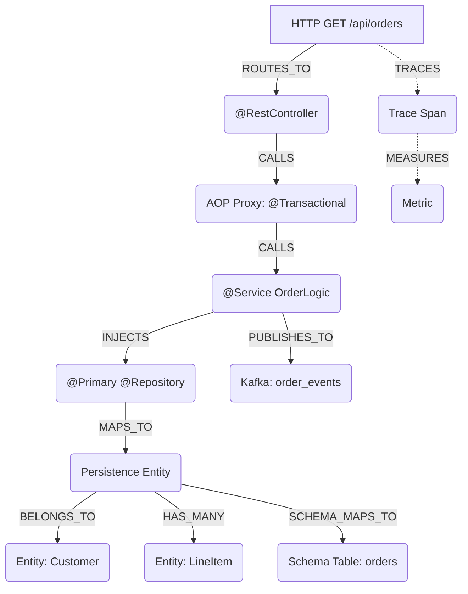

# 👻 Spring-Specter MCP

[](https://openjdk.java.net/)
[](https://spring.io/projects/spring-boot)
[](https://modelcontextprotocol.io/)
[](https://stomp.github.io/)
[](https://anthropic.com/)

**Spring-Specter** is a framework-aware Model Context Protocol (MCP) server built for AI Coding Agents (Claude, Cline, Command Code). Unlike generic AST parsers that only see surface-level syntax trees, Specter acts as a **Runtime Context Simulator** — utilizing JavaParser, ASM Bytecode Analysis, and an embedded Apache Lucene index to map the invisible runtime architecture of Spring Boot applications directly to AI agents.

## 🧠 What Specter Sees

Specter builds a deterministic, in-memory directed graph of your application's true runtime state:



## ✨ Full Capability Matrix

### Runtime Topology (Pass 1 + Pass 2)

| Resolver | What It Maps | Graph Nodes |
|----------|-------------|-------------|
| **BeanRegistryResolver** | `@ComponentScan` simulation — discovers active beans by profile | 7 stereotype types |
| **SpringDependencyResolver** | `@Autowired`, `@Qualifier`, `@Primary` injection chains | INJECTS edges |
| **AopProxyResolver** | `@Transactional`, `@Async`, `@Cacheable` interception boundaries | PROXY nodes |
| **WebMvcResolver** | `@GetMapping`, `@PostMapping`, `@RequestMapping` → REST API surface | CONTROLLER_ENDPOINT |
| **SpringDataResolver** | `@OneToMany`/`@ManyToOne` → relational edges across JPA/MongoDB/Cassandra/R2DBC | PERSISTENCE_ENTITY + HAS_MANY/BELONGS_TO |
| **MessagingResolver** | `@KafkaListener`, `@RabbitListener`, `@JmsListener`, `@StreamListener` → broker topology | MESSAGE_TOPIC + PUBLISHES_TO/SUBSCRIBES_FROM |
| **ProxyAnalysisResolver** | ASM bytecode scan — detects CGLIB/JDK dynamic proxies invisible to source-only tools | PROXY + PROXY_STEREOTYPE |
| **SecurityFilterChainResolver** | `SecurityFilterChain`, `@PreAuthorize`, `@Secured` → security boundary map | SECURITY_FILTER + SECURED_BY |
| **ConfigurationPropertiesResolver** | `@ConfigurationProperties`, `@Value` → config injection tracing | CONFIGURATION + USES_CONFIG |
| **OpenApiResolver** | SpringDoc/OpenAPI annotation & spec-file parsing | OPERATION_DOCUMENTATION |
| **ServiceCallResolver** | `RestTemplate`, `WebClient`, `@FeignClient` → service-to-service call graph | EXTERNAL_SERVICE + CALLS_REMOTE |
| **TestCoverageResolver** | `@SpringBootTest`, `@WebMvcTest`, `@MockBean` → test-to-component coverage matrix | TESTS/MOCKS edges |

### Enterprise Health & Observability (Phase 11)

| Resolver | What It Maps | Health Dimension |
|----------|-------------|-----------------|
| **ObservabilityResolver** | `@Timed`, `MeterRegistry` injection, `@NewSpan` tracing, `@Slf4j` logging | OBSERVABILITY_HEALTH |
| **PerformancePatternResolver** | N+1 query hotspots, missing `@Transactional`, `@Cacheable` gaps, lazy-loading flags | (performance antipattern detection) |

### Schema & Architecture Governance (Phases 12-15)

| Resolver / Engine | Purpose |
|-------------------|---------|
| **ArchitectureRuleEngine** | 5 built-in rules (ARCH-001 to ARCH-005) + custom rule DSL. Evaluates `CONTROLLER→REPOSITORY` violations, messaging misuse, security breaches |
| **GraphDiff** | Snapshots + diff engine — captures graph state before/after refactors, computes blast radius of all changes |
| **DatabaseSchemaResolver** | Parses Flyway `V*.sql` + Liquibase XML changelogs → correlates `@Table`/`@Column` entities with actual DB schema |

### Real-time Streaming (Phase 16)

- **WebSocket STOMP** endpoint at `/specter-ws` with SockJS fallback
- 3 topics: `/topic/graph-updates`, `/topic/health-updates`, `/topic/analysis-progress`
- Non-blocking publish — WebSocket failures never abort analysis

### AI-Powered Remediation (Phase 17)

- **RemediationEngine** calls Claude 3.7 Sonnet via Anthropic API
- Generates specific before/after code fixes with downtime assessments and effort estimates
- API only invoked when tools are explicitly called — never during analysis passes

### GraalVM Native Readiness (Phase 19)

- Detects reflection usage, dynamic proxies, resource loading without AOT hints
- Flags `@Lazy`, non-singleton scopes incompatible with native compilation
- Positive detection of `@RegisterReflectionForBinding` / `@ImportRuntimeHints`

## 🚀 43 MCP Tools

### Core Graph Query (7 tools)
| Tool | Description |
|------|-------------|
| `search_architecture(query)` | Lucene full-text fuzzy search across all node types with type-biased scoring |
| `simulate_dependency_injection(interface, qualifier)` | Resolves exact concrete class Spring injects, handling `@Primary`/`@Qualifier` |
| `get_transaction_boundaries(class, depth)` | Maps `@Transactional` proxy interception points along CALLS chain |
| `calculate_blast_radius(class, depth)` | Bidirectional impact analysis — downstream consumers + upstream dependencies |
| `trace_message_flow(channel)` | Full producer→consumer topology across Kafka, RabbitMQ, JMS, Cloud Stream |
| `analyze_dependency_cycle()` | DFS cycle detection over INJECTS edges with cycle path output |
| `get_graph_summary()` | Node/edge type breakdowns, active bean count |

### Security & Routing (3 tools)
| Tool | Description |
|------|-------------|
| `get_api_surface()` | Every `@RequestMapping` endpoint with HTTP verb, path, produces/consumes |
| `get_extraneous_endpoints()` | Endpoints not covered by any `SecurityFilterChain` |
| `analyze_proxy_chain(class)` | Full CGLIB/JDK proxy delegation chain for any intercepted bean |

### Observability & Performance (6 tools)
| Tool | Description |
|------|-------------|
| `get_observability_map()` | All METRIC/TRACE_SPAN/HEALTH_INDICATOR nodes mapped to production components |
| `find_uninstrumented_services()` | Services with no `@Timed`, no tracing, no MeterRegistry |
| `get_architectural_health()` | 7-dimension composite health score with critical issues and recommendations |
| `find_performance_antipatterns()` | N+1 hotspots, missing transactions, eager-loaded `@OneToMany` |
| `analyze_transaction_scope(class)` | Full transactional call tree — distributed transaction risks |

### Architecture Rules & Governance (4 tools)
| Tool | Description |
|------|-------------|
| `evaluate_architecture_rules()` | 5 built-in rules + custom rules — CONTROLLER→REPOSITORY, messaging misuse, etc. |
| `add_custom_rule(...)` | Add custom edge-type constraints between node types |
| `take_snapshot(label)` | Capture graph state for before/after diff comparison |
| `diff_snapshots(before, after)` | Added/removed/changed nodes + composite blast radius |
| `list_snapshots()` | All snapshots with labels and timestamps |

### Schema (2 tools)
| Tool | Description |
|------|-------------|
| `correlate_entity_schema()` | Entity↔Table cross-reference — finds missing tables, missing columns, orphan schemas |
| `get_migration_timeline()` | Ordered Flyway/Liquibase migration history with tables/columns per migration |

### Multi-Project & Streaming (5 tools)
| Tool | Description |
|------|-------------|
| `switch_project(path, sourceRoot)` | Hot-swap analysis context without restart |
| `list_projects()` | All cached project contexts |
| `get_websocket_endpoint()` | WebSocket URL + topic descriptions for real-time subscriptions |
| `set_active_profiles(profiles)` | Switch active Spring profiles for `@Profile`-aware analysis |

### AI Remediation (2 tools)
| Tool | Description |
|------|-------------|
| `suggest_fix(nodeId, issue)` | Claude-generated specific code fix with before/after snippets + downtime risk |
| `auto_remediate_all()` | Full health check → prioritized remediation backlog with effort estimates |

### Provenance & Native (5 tools)
| Tool | Description |
|------|-------------|
| `audit_provenance()` | GPG key expiry, SSH signature compliance, merge attestation verification |
| `audit_native_compatibility()` | GraalVM readiness score — reflection/proxy/resource/scoping risk breakdown |
| `find_bean_by_name(name)` | Exact bean lookup with full metadata |
| `get_conditional_bean_report()` | Beans gated behind `@ConditionalOn*` with their active/inactive status |
| `get_transaction_boundary_report()` | All transactional boundaries across the entire graph |

## 🏗 Architecture

```
spring-specter-mcp/
├── specter-core/                    # Graph engine + 14 resolvers
│   └── src/main/java/com/specter/core/
│       ├── graph/                   # 30 NodeTypes, 24 EdgeTypes, SpecterGraph
│       ├── parser/                  # 14 FrameworkResolvers
│       │   ├── BeanRegistryResolver          # Pass 1: @ComponentScan
│       │   ├── SpringDependencyResolver       # @Autowired/@Qualifier
│       │   ├── AopProxyResolver              # @Aspect proxy rewiring
│       │   ├── WebMvcResolver                # HTTP endpoint mapping
│       │   ├── SpringDataResolver            # Repository/entity + relational edges
│       │   ├── MessagingResolver             # Kafka/Rabbit/Cloud Stream topology
│       │   ├── ProxyAnalysisResolver         # ASM bytecode proxy detection
│       │   ├── SecurityFilterChainResolver    # Security boundary mapping
│       │   ├── ConfigurationPropertiesResolver # Config injection tracing
│       │   ├── OpenApiResolver               # OpenAPI spec correlation
│       │   ├── ServiceCallResolver           # REST/Feign/gRPC call mapping
│       │   ├── TestCoverageResolver          # Test→component coverage
│       │   ├── ObservabilityResolver         # Metrics/tracing/logging
│       │   ├── PerformancePatternResolver    # N+1, missing transactions
│       │   ├── DatabaseSchemaResolver         # Flyway/Liquibase ↔ entity
│       │   └── GraalVmCompatibilityResolver  # Native/AOT readiness
│       ├── registry/                # BeanRegistry with conditional metadata
│       ├── index/                   # Lucene RAM-based index
│       ├── analysis/                # HealthAnalyzer (7 dimensions), GraphDiff, RiskScore
│       ├── rules/                   # ArchitectureRuleEngine + RuleLibrary (5 built-in)
│       ├── watcher/                 # Incremental file change detection
│       ├── provenance/              # Git signature verification
│       └── SpecterAnalysisEngine    # Two-pass pipeline orchestrator
│
├── specter-server/                  # MCP Server + WebSocket
│   └── src/main/java/com/specter/server/
│       ├── SpecterServerApplication  # Spring Boot entry point
│       ├── tools/SpecterMcpTools     # 43 MCP tool endpoints
│       ├── streaming/                # WebSocket STOMP (GraphChangePublisher, WebSocketConfig)
│       └── remediation/              # AI-powered fix generation (RemediationEngine)
│
└── .github/workflows/ci.yml         # CI/CD with architecture gate + PR comment
```

## 🩺 7-Dimension Health Scoring

| Dimension | What It Measures | Weight |
|-----------|-----------------|--------|
| **DEPENDENCY_HEALTH** | Circular INJECTS edges, layering violations, excessive fan-out | Service isolation |
| **SECURITY_HEALTH** | Unsecured endpoints, missing `@PreAuthorize`, filter coverage gaps | Attack surface |
| **RESILIENCE_HEALTH** | No `@Retryable`, no `@CircuitBreaker`, single points of failure | Fault tolerance |
| **TEST_HEALTH** | Service/controller nodes with no TESTS edges, uncovered REST endpoints | Regression safety |
| **OBSERVABILITY_HEALTH** | Unmetered services, missing traces, no HealthIndicator for repositories | Production visibility |
| **CONTRACT_HEALTH** | OpenAPI spec coverage, endpoint documentation gaps | API governance |
| **ARCHITECTURE_RULES_HEALTH** | ARCH-001 to ARCH-005 + custom rule violations | Layered architecture enforcement |

## 📦 Building & Running

**Prerequisites**: Java 25 (LTS), Maven 3.9+

```bash
# Build both modules
mvn clean compile

# Run MCP server (STDIO mode — default)
mvn -pl specter-server spring-boot:run

# Run with WebSocket + HTTP API
SPRING_PROFILES_ACTIVE=http mvn -pl specter-server spring-boot:run \
  -Dspring-boot.run.arguments="--specter.source.root=./src"

# AI remediation (optional)
export ANTHROPIC_API_KEY=sk-ant-...
```

> **⚠️ Compilation Requirement**: The target project must be compiled (`mvn compile`) before analysis. `ProxyAnalysisResolver` reads `.class` files via ASM to detect CGLIB/JDK proxies. Without compilation, `@Transactional`/`@Async` interception boundaries will be invisible.

### WebSocket Streaming

Connect to `ws://localhost:8765/specter-ws` using any STOMP client:

```
STOMP CONNECT → /specter-ws
SUBSCRIBE → /topic/graph-updates      # Graph summary after each analysis
SUBSCRIBE → /topic/health-updates      # Health score changes
SUBSCRIBE → /topic/analysis-progress   # Per-resolver progress (phase, node count, edge count)
```

## 📄 License

[Apache License 2.0](LICENSE)
