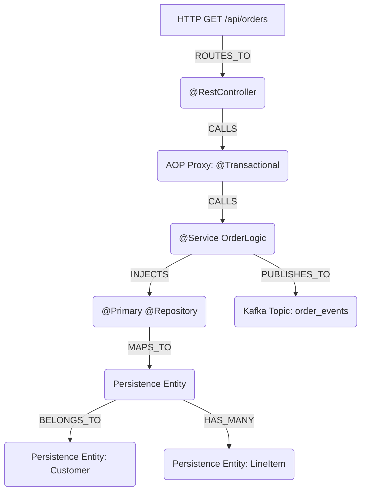

# 👻 Spring-Specter MCP

[](https://openjdk.java.net/)
[](https://spring.io/projects/spring-boot)
[](https://modelcontextprotocol.io/)

**Spring-Specter** is a framework-aware Model Context Protocol (MCP) server built for AI Coding Agents (Claude, Cline, Command Code). 

Unlike generic AST parsers that only see surface-level syntax trees, Specter acts as a **Runtime Context Simulator**. It utilizes JavaParser, ASM Bytecode Analysis, and an embedded Apache Lucene index to map the invisible runtime architecture of Spring Boot applications, exposing AOP proxies, active beans, and multi-tenant messaging topologies directly to AI agents.

## 🧠 Architectural Topography

Specter builds a deterministic, in-memory directed graph of your application's true runtime state.


## ✨ Core Capabilities

- **Java 25 & Virtual Threads**: Built on the bleeding-edge LTS. Traverses massive enterprise graphs utilizing millions of lightweight virtual threads for sub-millisecond graph resolution.

- **AOP & Proxy Tracing (ASM)**: Reads compiled bytecode to detect invisible Spring CGLIB and JDK dynamic proxies (e.g., `@Transactional`, `@Async`).

- **HTTP API Boundary Mapping**: Parses `@GetMapping`, `@PostMapping`, `@RequestMapping` annotations to expose every REST entry point as `CONTROLLER_ENDPOINT` nodes with full HTTP verb and path metadata.

- **Relational Database Edges**: Parses `@OneToMany` → `HAS_MANY` and `@ManyToOne` → `BELONGS_TO` annotations so AI agents understand table joins and entity relationships.

- **Universal Persistence**: Dynamically maps repositories and entities across JPA, MongoDB, Cassandra, and R2DBC without hardcoded coupling.

- **Strict Provenance Verification**: Cryptographically audits Git history, strictly enforcing modern SSH-based commit signatures while rejecting legacy GPG configs.

## 🚀 Usage (AI Agents)

Configure your agent to connect to Specter via STDIO. Provide it with your compiled project root.

> **⚠️ Compilation Requirement**: The target project **must be compiled** (`mvn clean compile`) before Specter analyzes it. The `ProxyAnalysisResolver` reads `.class` files via ASM bytecode analysis to detect CGLIB/JDK proxy classes. Without compilation, the proxy tracing pass finds nothing — `@Transactional` and `@Async` interception boundaries will be invisible to the graph.

### Available MCP Tools

| Tool | Description |
|------|-------------|
| `search_architecture(query)` | Full-text fuzzy search via embedded Lucene across all stereotypes |
| `simulate_dependency_injection(interface, qualifier)` | Resolves exact concrete class Spring will inject, handling `@Primary`/`@Qualifier` |
| `get_transaction_boundaries(service, depth)` | Maps `@Transactional` AOP proxy interception points along CALLS chain |
| `calculate_blast_radius(class, depth)` | Bidirectional graph traversal for downstream/upstream impact analysis |
| `trace_message_flow(channel)` | Full producer→consumer topology across Kafka, RabbitMQ, JMS, Cloud Stream |
| `analyze_dependency_cycle()` | Detects circular `INJECTS` loops in the Spring dependency graph |
| `get_graph_summary()` | High-level architectural overview with node/edge type breakdowns |

---

## 🏗 Architecture

```
specter-mcp/
├── specter-core/              # Graph engine + resolvers
│   └── src/main/java/com/specter/core/
│       ├── graph/             # NodeType, EdgeType, SpecterNode, SpecterEdge, SpecterGraph
│       ├── parser/            # FrameworkResolvers (7 resolvers)
│       │   ├── BeanRegistryResolver    # Pass 1: @ComponentScan simulation
│       │   ├── SpringDependencyResolver # Pass 2: @Autowired/@Qualifier resolution
│       │   ├── AopProxyResolver        # Pass 2: @Aspect proxy wiring
│       │   ├── WebMvcResolver          # Pass 2: HTTP endpoint mapping
│       │   ├── SpringDataResolver      # Pass 2: Repository/entity + relational edges
│       │   ├── MessagingResolver       # Pass 2: Kafka/Rabbit/Cloud Stream topology
│       │   └── ProxyAnalysisResolver   # Pass 2: ASM bytecode proxy detection
│       ├── registry/          # BeanRegistry with @Primary/@Qualifier metadata
│       ├── index/             # Lucene RAM-based index (SpecterIndexWriter/Searcher)
│       └── SpecterAnalysisEngine.java  # Two-pass pipeline orchestrator
│
├── specter-server/            # MCP Server (STDIO transport)
│   └── src/main/java/com/specter/server/
│       ├── SpecterServerApplication.java  # Spring Boot entry point
│       └── tools/SpecterMcpTools.java     # 7 MCP tool endpoints
│
└── .github/workflows/ci.yml   # CI/CD pipeline
```

## 📦 Building

**Prerequisites**: Java 25 (LTS), Maven 3.9+

```bash
# Build both modules
mvn clean compile

# Run the MCP server (STDIO mode)
mvn -pl specter-server spring-boot:run
```

## 📄 License

[Apache License 2.0](LICENSE)
