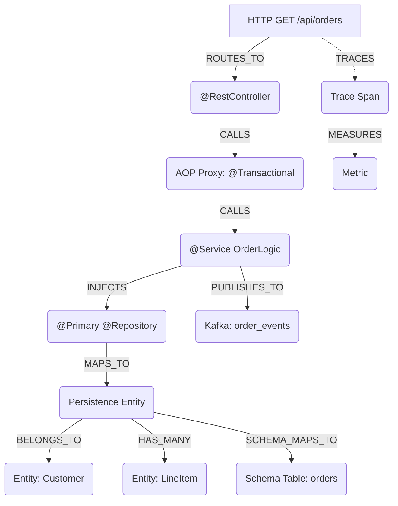

# 👻 Spring-Specter MCP

[](https://openjdk.java.net/)
[](https://spring.io/projects/spring-boot)
[](https://modelcontextprotocol.io/)
[](https://stomp.github.io/)
[](https://anthropic.com/)
[](LICENSE)

**Spring-Specter** is a framework-aware Model Context Protocol (MCP) server built for AI Coding Agents (Claude, Cline, Command Code). Unlike generic AST parsers that only see surface-level syntax trees, Specter acts as a **Runtime Context Simulator** — utilizing JavaParser, ASM Bytecode Analysis, and an embedded Apache Lucene index to map the invisible runtime architecture of Spring Boot applications directly to AI agents.

## 🧠 What Specter Sees

Specter builds a deterministic, in-memory directed graph of your application's true runtime state:



## ✨ Full Capability Matrix

### Runtime Topology (Pass 1 + Pass 2)

| Resolver | What It Maps | Graph Nodes |
|----------|-------------|-------------|
| **BeanRegistryResolver** | `@ComponentScan` simulation — discovers active beans by profile, evaluates `@ConditionalOnProperty` against `application.properties` | 7 stereotype types |
| **SpringDependencyResolver** | `@Autowired`, `@Qualifier`, `@Primary` injection chains | INJECTS edges |
| **AopProxyResolver** | `@Transactional`, `@Async`, `@Cacheable` interception boundaries | PROXY nodes |
| **WebMvcResolver** | `@GetMapping`, `@PostMapping`, `@RequestMapping` → REST API surface | CONTROLLER_ENDPOINT |
| **SpringDataResolver** | `@OneToMany`/`@ManyToOne` → relational edges across JPA/MongoDB/Cassandra/R2DBC | PERSISTENCE_ENTITY + HAS_MANY/BELONGS_TO |
| **MessagingResolver** | `@KafkaListener`, `@RabbitListener`, `@JmsListener`, `@StreamListener` → broker topology | MESSAGE_TOPIC + PUBLISHES_TO/SUBSCRIBES_FROM |
| **ProxyAnalysisResolver** | ASM bytecode scan — detects CGLIB/JDK dynamic proxies invisible to source-only tools | PROXY + PROXY_STEREOTYPE |
| **SecurityFilterChainResolver** | `SecurityFilterChain`, `@PreAuthorize`, `@Secured` → security boundary map | SECURITY_FILTER + SECURED_BY |
| **ConfigurationPropertiesResolver** | `@ConfigurationProperties`, `@Value` → config injection tracing | CONFIGURATION + USES_CONFIG |
| **OpenApiResolver** | SpringDoc/OpenAPI annotation & spec-file parsing | OPERATION_DOCUMENTATION |
| **ServiceCallResolver** | `RestTemplate`, `WebClient`, `@FeignClient` → service-to-service call graph | EXTERNAL_SERVICE + CALLS_REMOTE |
| **TestCoverageResolver** | `@SpringBootTest`, `@WebMvcTest`, `@MockBean` → test-to-component coverage matrix | TESTS/MOCKS edges |

### Enterprise Health & Observability

| Resolver | What It Maps | Health Dimension |
|----------|-------------|-----------------|
| **ObservabilityResolver** | `@Timed`, `MeterRegistry` injection, `@NewSpan` tracing, `@Slf4j` logging | OBSERVABILITY_HEALTH |
| **PerformancePatternResolver** | N+1 query hotspots, missing `@Transactional`, `@Cacheable` gaps, lazy-loading flags | (performance antipattern detection) |

### Schema & Architecture Governance

| Resolver / Engine | Purpose |
|-------------------|---------|
| **ArchitectureRuleEngine** | 5 built-in rules (ARCH-001 to ARCH-005) + custom rule DSL. Evaluates `CONTROLLER→REPOSITORY` violations, messaging misuse, security breaches |
| **GraphDiff** | Snapshots + diff engine — captures graph state before/after refactors, computes blast radius of all changes |
| **DatabaseSchemaResolver** | Parses Flyway `V*.sql` + Liquibase XML changelogs → correlates `@Table`/`@Column` entities with actual DB schema |

### Real-time Streaming

- **WebSocket STOMP** endpoint at `/specter-ws` with SockJS fallback
- 3 topics: `/topic/graph-updates`, `/topic/health-updates`, `/topic/analysis-progress`
- Non-blocking publish — WebSocket failures never abort analysis

### AI-Powered Remediation

- **RemediationEngine** calls Claude Sonnet 4 via Anthropic API
- Generates specific before/after code fixes with downtime assessments and effort estimates
- API only invoked when tools are explicitly called — never during analysis passes

### GraalVM Native Readiness

- Detects reflection usage, dynamic proxies, resource loading without AOT hints
- Flags `@Lazy`, non-singleton scopes incompatible with native compilation
- Positive detection of `@RegisterReflectionForBinding` / `@ImportRuntimeHints`

## 🚀 41 MCP Tools

### Core Graph Query (7 tools)
| Tool | Description |
|------|-------------|
| `search_architecture(query)` | Lucene full-text fuzzy search across all node types with type-biased scoring |
| `simulate_dependency_injection(interface, qualifier)` | Resolves exact concrete class Spring injects, handling `@Primary`/`@Qualifier` |
| `get_transaction_boundaries(class, depth)` | Maps `@Transactional` proxy interception points along CALLS chain |
| `calculate_blast_radius(class, depth)` | Bidirectional impact analysis — downstream consumers + upstream dependencies |
| `trace_message_flow(channel)` | Full producer→consumer topology across Kafka, RabbitMQ, JMS, Cloud Stream |
| `analyze_dependency_cycle()` | DFS cycle detection over INJECTS edges with cycle path output |
| `get_graph_summary()` | Node/edge type breakdowns, active bean count |

### Security & Audit (5 tools)
| Tool | Description |
|------|-------------|
| `get_api_surface()` | Every `@RequestMapping` endpoint with HTTP verb, path, produces/consumes |
| `audit_security_boundaries()` | Checks for missing `@PreAuthorize`, unsecured endpoints, CORS gaps |
| `get_security_filter_chain()` | Full Spring Security filter chain with URL patterns and access rules |
| `find_undocumented_endpoints()` | Endpoints not covered by any OpenAPI spec annotation |
| `audit_git_provenance()` | GPG key expiry, SSH signature compliance, merge attestation verification |

### Topology & Dependencies (5 tools)
| Tool | Description |
|------|-------------|
| `get_service_topology(class)` | Full call graph — CALLS/INJECTS/PUBLISHES/SUBSCRIBES edges for a service |
| `get_module_dependency_graph()` | Inter-module dependency graph — Maven multi-module awareness |
| `find_cross_module_violations()` | Edge crossings that violate module layering rules |
| `get_dto_lineage(class)` | Traces a DTO from creation through transformations across services |
| `refresh_analysis()` | Re-run full analysis pass on the current source root |

### Configuration & Properties (2 tools)
| Tool | Description |
|------|-------------|
| `trace_config_property(key)` | End-to-end trace of a config property from source through injection |
| `audit_undefined_properties()` | `@Value`-referenced properties with no definition in any config source |

### Testing & Resilience (3 tools)
| Tool | Description |
|------|-------------|
| `get_test_coverage_map()` | Maps test classes to production components via abstract interpretation |
| `find_untested_components()` | Components with no corresponding test class |
| `find_resilience_gaps()` | Missing `@Retryable`, no `@CircuitBreaker`, single-threaded risks |

### Observability & Performance (5 tools)
| Tool | Description |
|------|-------------|
| `get_observability_map()` | All METRIC/TRACE_SPAN/HEALTH_INDICATOR nodes mapped to production components |
| `find_uninstrumented_services()` | Services with no `@Timed`, no tracing, no MeterRegistry |
| `get_architectural_health()` | 7-dimension composite health score with critical issues and recommendations |
| `find_performance_antipatterns()` | N+1 hotspots, missing transactions, eager-loaded `@OneToMany` |
| `analyze_transaction_scope(class)` | Full transactional call tree — distributed transaction risks |

### Architecture Rules & Governance (5 tools)
| Tool | Description |
|------|-------------|
| `evaluate_architecture_rules()` | 5 built-in rules + custom rules — CONTROLLER→REPOSITORY, messaging misuse, etc. |
| `add_custom_rule(...)` | Add custom edge-type constraints between node types |
| `take_snapshot(label)` | Capture graph state for before/after diff comparison |
| `diff_snapshots(before, after)` | Added/removed/changed nodes + composite blast radius |
| `list_snapshots()` | All snapshots with real capture timestamps |

### Schema (2 tools)
| Tool | Description |
|------|-------------|
| `correlate_entity_schema()` | Entity↔Table cross-reference — finds missing tables, missing columns, orphan schemas |
| `get_migration_timeline()` | Ordered Flyway/Liquibase migration history with tables/columns per migration |

### Multi-Project & Streaming (4 tools)
| Tool | Description |
|------|-------------|
| `switch_project(path, sourceRoot)` | Hot-swap analysis context without restart |
| `list_projects()` | All cached project contexts |
| `register_project(name, path)` | Register a new project — idempotent, same path returns existing context |
| `get_websocket_endpoint()` | WebSocket URL + topic descriptions for real-time subscriptions |

### AI Remediation (2 tools)
| Tool | Description |
|------|-------------|
| `suggest_fix(nodeId, issue)` | Claude-generated specific code fix with before/after snippets + downtime risk |
| `auto_remediate_all()` | Full health check → prioritized remediation backlog with effort estimates |

### Provenance & Native (1 tool)
| Tool | Description |
|------|-------------|
| `audit_native_compatibility()` | GraalVM readiness score — reflection/proxy/resource/scoping risk breakdown |

## 🏗 Architecture

```
spring-specter-mcp/
├── specter-core/                    # Graph engine + 16 resolvers
│   └── src/main/java/com/specter/core/
│       ├── graph/                   # SpecterGraph (O(1) adjacency-list indexes), NodeType, EdgeType
│       ├── parser/                  # 16 FrameworkResolvers (2 sequential + 12 parallel + 2 optional)
│       │   ├── BeanRegistryResolver          # Pass 1: @ComponentScan + @ConditionalOnProperty eval
│       │   ├── SpringDependencyResolver       # Pass 2a (sequential): @Autowired/@Qualifier
│       │   ├── AopProxyResolver              # Pass 2a (sequential): @Aspect proxy rewiring
│       │   ├── WebMvcResolver                # Pass 2b (parallel): HTTP endpoint mapping
│       │   ├── SpringDataResolver            # Pass 2b (parallel): Repository/entity edges
│       │   ├── MessagingResolver             # Pass 2b (parallel): Kafka/Rabbit topology
│       │   ├── ProxyAnalysisResolver         # Pass 2a (sequential, optional): ASM bytecode
│       │   ├── SecurityFilterChainResolver    # Pass 2b (parallel): Security boundary mapping
│       │   ├── ConfigurationPropertiesResolver # Pass 2b (parallel): Config injection tracing
│       │   ├── OpenApiResolver               # Pass 2b (parallel): OpenAPI spec correlation
│       │   ├── ServiceCallResolver           # Pass 2b (parallel): REST/Feign call mapping
│       │   ├── TestCoverageResolver          # Pass 2b (parallel): Test→component coverage
│       │   ├── ObservabilityResolver         # Pass 2b (parallel): Metrics/tracing/logging
│       │   ├── PerformancePatternResolver    # Pass 2b (parallel): N+1, missing transactions
│       │   ├── DatabaseSchemaResolver         # Pass 2b (parallel): Flyway/Liquibase ↔ entity
│       │   └── GraalVmCompatibilityResolver  # Pass 2b (parallel): Native/AOT readiness
│       ├── registry/                # BeanRegistry with conditional + profile metadata
│       ├── index/                   # Lucene RAM-based index
│       ├── analysis/                # HealthAnalyzer (7 dimensions), GraphDiff, RiskScore
│       ├── rules/                   # ArchitectureRuleEngine + RuleLibrary (5 built-in)
│       ├── watcher/                 # Incremental file fingerprinting (SHA-256 + mtime)
│       ├── persistence/             # GraphSerializer — graph + snapshot JSON persistence
│       ├── provenance/              # Git signature verification
│       └── SpecterAnalysisEngine    # Two-pass pipeline orchestrator
│
├── specter-server/                  # MCP Server + WebSocket
│   └── src/main/java/com/specter/server/
│       ├── SpecterServerApplication  # Spring Boot entry point
│       ├── ProjectRegistry           # Idempotent multi-project context manager
│       ├── tools/SpecterMcpTools     # 41 MCP tool endpoints
│       ├── streaming/                # WebSocket STOMP (GraphChangePublisher, WebSocketConfig)
│       └── remediation/              # AI-powered fix generation (RemediationEngine)
│
└── .github/workflows/ci.yml         # CI/CD with architecture gate + PR comment
```

## ⚙️ Analysis Pipeline

```
Source Root
    │
    ▼
[Pass 1] BeanRegistryResolver          — sequential, must complete first
    │  Simulates @ComponentScan, evaluates @ConditionalOnProperty,
    │  @Profile filtering, resolves @Bean factory methods
    │
    ▼
[Pass 2a] Sequential Resolvers         — ordered (dependency matters)
    │  SpringDependencyResolver  →  adds CALLS + INJECTS edges
    │  AopProxyResolver          →  reads CALLS edges, inserts PROXY nodes
    │  ProxyAnalysisResolver     →  ASM bytecode (if classesRoot provided)
    │
    ▼
[Pass 2b] Parallel Resolvers           — 12 resolvers on virtual threads
    │  WebMvc, SpringData, Messaging, Security, ConfigProps,
    │  OpenApi, ServiceCall, TestCoverage, Observability,
    │  PerformancePattern, DatabaseSchema, GraalVm
    │
    ▼
[Index]  Lucene RAM index — all nodes + edges committed
```

## 🩺 7-Dimension Health Scoring

Health is scored 0–100 using equal-weighted dimension averages. Each dimension
is computed independently — the overall score uses floating-point division to
prevent integer-truncation rounding errors.

| Dimension | What It Measures |
|-----------|-----------------|
| **DEPENDENCY_HEALTH** | Circular INJECTS edges, layering violations, excessive fan-out |
| **SECURITY_HEALTH** | Unsecured endpoints, missing `@PreAuthorize`, filter coverage gaps |
| **RESILIENCE_HEALTH** | No `@Retryable`, no `@CircuitBreaker`, single points of failure |
| **TEST_HEALTH** | Service/controller nodes with no TESTS edges, uncovered REST endpoints |
| **OBSERVABILITY_HEALTH** | Unmetered services, missing traces, no HealthIndicator for repositories |
| **CONTRACT_HEALTH** | OpenAPI spec coverage, endpoint documentation gaps |
| **ARCHITECTURE_RULES_HEALTH** | ARCH-001 to ARCH-005 standard rule violations (custom rules not included) |

## 📦 Building & Running

**Prerequisites**: Java 25 (LTS), Maven 3.9+

```bash
# Build both modules
mvn clean compile

# Run MCP server (STDIO mode — default)
mvn -pl specter-server spring-boot:run

# Run with WebSocket + HTTP API
SPRING_PROFILES_ACTIVE=http mvn -pl specter-server spring-boot:run \
  -Dspring-boot.run.arguments="--specter.source.root=./src"

# AI remediation (optional)
export ANTHROPIC_API_KEY=sk-ant-...
```

> **⚠️ Compilation Requirement**: The target project must be compiled (`mvn compile`) before analysis. `ProxyAnalysisResolver` reads `.class` files via ASM to detect CGLIB/JDK proxies. Without compilation, `@Transactional`/`@Async` interception boundaries will be invisible.

### WebSocket Streaming

Connect to `ws://localhost:8765/specter-ws` using any STOMP client:

```
STOMP CONNECT → /specter-ws
SUBSCRIBE → /topic/graph-updates      # Graph summary after each analysis
SUBSCRIBE → /topic/health-updates      # Health score changes
SUBSCRIBE → /topic/analysis-progress   # Per-resolver progress (phase, node count, edge count)
```

## 📄 License

[Apache License 2.0](LICENSE)
